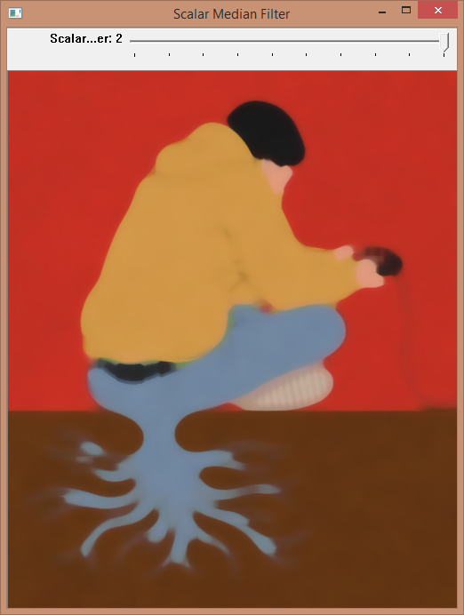

# Convert images utilities using OpenCV
Author: Grozov Roman

The source code for the two utilities in C ++. Has the following features: gamma correction, sigmoid function correction, scalar median filter, vector median filter (norm of vector: euclidean distance, Manhattan distance). This programms using OpenCV 2.4.11.0 library.

##Nonlinear conversion of single-channel image
File lab01.cpp contains the source code of console utility that converts gray-scale, single-channel image with next features:
* Gamma correction,
* Sigmoid function correction.

<pre><code>lab001.exe input_image conversion [params] [output_image] [graph_image] </code></pre>

**input_image** - address of the original image.
  **conversion**: **-g** (Gamma correction), **-s** (Sigmoid function correction).
  **params**: **gamma [0; + inf)** (parameter gamma correction), **alpha [0; 20]** (the transformation parameter for sigmoid),  **beta [0, 100]** (conversion option for sigmoid).
  **output_image** - saving result of the conversion (run mode without visualization).
  **graph_image** - saving schedule transfer function.

Command example:
<pre><code>C:\lab001.exe C:\pic.jpg -g 10
С:\lab001.exe C:\pic.jpg -s 10 5 C:\transf.jpg C:\graph.jpg</pre></code>
 

##Scalar and vector median filter
File lab02.cpp contains the source code of console utility that two types of filters color images:
* Scalar median filter,
* Vector median filter (norm of vector: euclidean distance, Manhattan distance).

<pre><code>lab02.exe input_image conversion [params] [output_image]</pre></code>
**input_image** - address of the original image.
  **conversion**: **-s** (Scalar median filter), **-v** (Vector median filter).
  **params**: **radius** (radius of the core conversion), **-ed** (euclidean distance),  **-md** (Manhattan distance).
  **output_image** - saving result of the conversion (run mode without visualization).

Command example:
<pre><code>D:\lab02.exe D:\pic.jpg	-s
D:\lab02.exe D:\pic.jpg -v 2 -ed C:\transf.jpg</pre></code>
 
